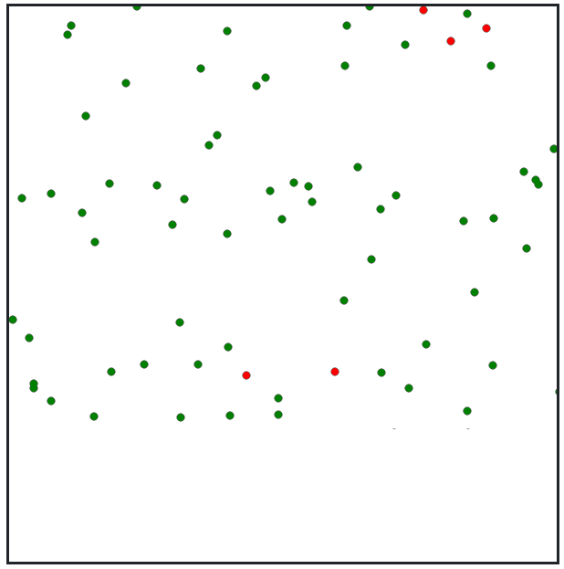

# Disease simulator

    Author: Roberts Ivanovs
    Project type: Final Course Project for Visual Programming Languages 2020
    Project name: Disease simulator
    E-mail: robertsivanovs1999@gmail.com

## Run project

Make sure to have `dotnet 5.0` installed. Execute the startup script:

    ./start.sh

## What is this?

A project created using serverside rendering Blazor for the Visual
Programming Language course in Ventspils University of Apllied Sciences
in December of 2020.

## What does it do?

Basic simulation of some kind of entities transmiting a disiease from
one to another.

## Warning

This project is not suitable to be placed on a server! It uses
multithreaded computing for managing the entities within the canvas - all
done serverside! The project was built like this because I wanted to try
out Blazor and I wanted to learn more about mutlithreaded programming.
